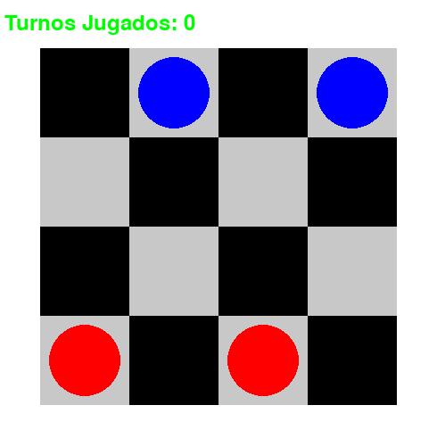

# 🎮 AI Checkers Agent: Q-Learning

Proyecto que implementa dos agentes de IA para jugar damas en un tablero 4x4:
- **Agente basado en conocimiento** usando Minimax con poda Alpha-Beta (Solo para el entrenamiento)
- **Agente de aprendizaje por refuerzo** utilizando Q-Learning



## 📦 Dependencias
- Python 3.8+
- Pygame 2.1.2

```bash
# Instalar dependencias
pip install pygame
```

# 🚀 Ejecución

### 1. Entrenar el agente Q-Learning
```bash
python train.py
```
- Entrena durante 1000 episodios contra un oponente aleatorio
- Guarda la Q-table en `q_table.json`
- Muestra estadísticas en tiempo real

### 2. Jugar contra la IA
```bash
python main.py
```
- **Modo humano vs IA**:
  - Jugador humano: `x` (fichas rojas)
  - IA: `o` (fichas azules)
- Interfaz gráfica con Pygame
- Máximo 64 turnos por partida

## 🗂 Estructura del Proyecto
| Archivo         | Descripción                                                                 |
|-----------------|-----------------------------------------------------------------------------|
| `layout.py`     | Interfaz gráfica con Pygame (dibujo del tablero y manejo de clics)         |
| `main.py`       | Lógica principal del juego humano vs IA                                    |
| `minimax.py`    | Implementación del algoritmo Minimax con poda Alpha-Beta para jugador `x`  |
| `q_learning.py` | Clase QLearningAgent con funciones de entrenamiento y tabla Q              |
| `train.py`      | Script de entrenamiento del agente Q-Learning                              |
| `utils.py`      | Funciones auxiliares (inicialización de tablero, movimientos, reglas)      |

## 🕹 Controles
- **Click izquierdo**: Seleccionar pieza
- **Click derecho**: Mover pieza seleccionada

## 📌 Notas Técnicas
- Tablero 4x4 con configuración inicial:
  ```
  - o - o
  - - - -
  - - - -
  x - x -
  ```
- Heurística básica: Conteo de piezas
- Sistema de recompensas Q-Learning con 12 factores estratégicos
